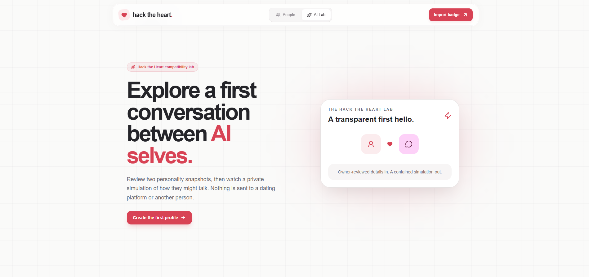
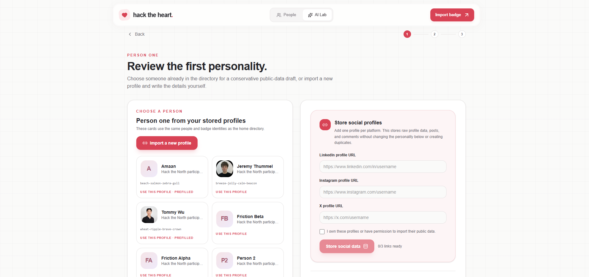
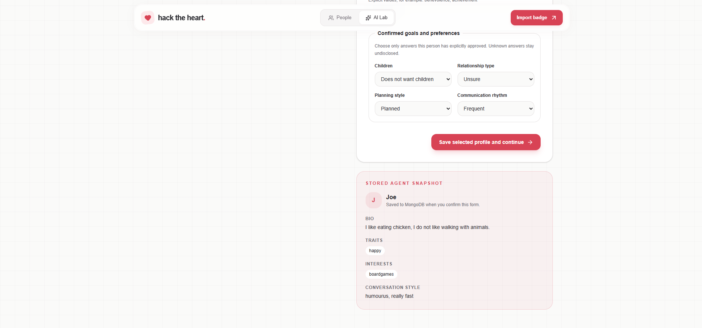

# Hack the Heart

> A conference badge that introduces two people, then lets their agents do the talking.

[Live app](https://hacktheheart.vercel.app) · [Devpost](https://devpost.com/software/airos-ca5l9u)

## Demo

[](https://www.youtube.com/watch?v=4g8lUuXfFBc)

## Gallery

<table>
  <tr>
    <td align="center" width="50%">
      <br>
      <sub>The dating lab where you can make AIs go on a date!</sub>
    </td>
    <td align="center" width="50%">
      <br>
      <sub>Selecting a person to have an AI agent represent.</sub>
    </td>
  </tr>
  <tr>
    <td align="center" colspan="2">
      <br>
      <sub>Seeing how that person is represented through our code.</sub>
    </td>
  </tr>
</table>

## Project specifications

| Spec | Value |
| --- | ---: |
| Conversation length | 6 turns |
| Agent roles per person | 4 |
| Reply cap | 45 words |
| Contacts per badge import | 250 |
| Inputs to the compatibility score | 5 |

## Inspiration

Finding a soul mate is a challenge (especially for programmers like us).

At a hackathon you walk past hundreds of people in three days, and you never find out who you would have clicked with. We were already wearing a badge that quietly remembers everyone we bump into, so we wanted that badge to do something useful with those names.

## What it does

Hack the Heart turns a badge bump into an introduction.

You can upload all your stored badge contacts to our server. Each person gets a profile built from the answers they approve themselves, along with their public posts. Two digital personalities constructed by AI agents, one acting for each person, then hold a short private conversation.

You can read the whole conversation, see why each agent said what it said, and see a compatibility score built from the answers both people actually gave. If you meet up for real afterwards, you tell the app how it went, and each person's agent learns from that.

## How we built it

### The badge

We read the contact files the badge writes, one per badge id. The app accepts an owner profile plus up to 250 contacts in a single batch. A preview step tells you what each contact will do before anything is saved, marking each one as new, filling missing fields, already known, or in conflict. Every route is rate limited. Any contact can be analyzed on demand to produce a headline, a summary, a list of interests, and exactly three conversation starters.

### The profile

Every person has a frozen profile built only from their own approved form answers. Every field carries an evidence id pointing back to the answer it came from. Public LinkedIn, Instagram and X posts are imported separately, and a Discord bot lets someone export their own messages.

### The conversation

Four agent roles run on one model.

1. **Social Interpreter.** Reads an incoming message through four psychological lenses and returns structured analysis, including how warm and how dominant the message reads. It is never allowed to write the visible reply.
2. **Voice Prompt Builder.** Studies the person's own writing and produces instructions about surface style only, such as casing, sentence length and punctuation.
3. **Persona Speaker.** Picks one action from a fixed list and writes one reply under 45 words.
4. **Reaction Adaptation Builder.** Runs after a real date is reported.

Vercel Workflow runs a fixed six turn sequence as durable steps, so any single step can retry safely.

### Keeping it honest

Zod validates every model reply. Evidence ids are checked against the stored profile and quotes are checked against the stored messages, and the turn fails if either check fails. MongoDB holds schema validators and unique indexes so a retry cannot create a duplicate. The compatibility score is calculated in plain TypeScript from the form answers, and both agents are forbidden from producing a score themselves.

## The compatibility score

We did not want every digital date to end well just because a model knows how to be polite. The Compatibility Analyst therefore returns categories, and plain TypeScript applies the same arithmetic every time.

For each person's reading of the conversation, five signals are converted to numbers:

| Signal | How the categories become numbers | Weight |
| --- | --- | ---: |
| Compatibility, C | Weak = 0, mixed = 50, strong = 100 | 25% |
| Friction, F | High = 0, moderate = 35, low = 70, none = 100 | 20% |
| Reciprocity, R | Weak = 0, mixed = 50, strong = 100 | 20% |
| Pacing, P | Mismatched = 0, mixed = 50, aligned = 100 | 15% |
| Connection, N | Absent = 0, uncertain = 50, present = 100 | 20% |

The base score for person i is:

```text
bᵢ = round(clamp[0,100](0.25Cᵢ + 0.20Fᵢ + 0.20Rᵢ + 0.15Pᵢ + 0.20Nᵢ))
```

The weights add up to one, so the result stays on a 0 to 100 scale. Friction runs backwards because more friction should contribute less. Compatibility gets the largest share, pacing the smallest, and the other three signals get equal shares. This makes the rule easy to inspect and tune. These are hand-set application weights, not coefficients fitted to successful relationships, and the code does not establish that these exact weights are optimal.

For example, strong compatibility, low friction, mixed reciprocity, aligned pacing and uncertain connection give:

```text
bᵢ = round(25 + 14 + 10 + 15 + 10) = 74
```

There is also a shared-ground rule. If either analyst marks shared ground as `limited`, both scores become 50. This represents a neutral outcome: enough conversation to find little common ground, without treating that as a hard conflict. `Unclear` is a separate category and does not trigger this rule.

| Condition | Score nᵢ |
| --- | ---: |
| Either analyst reports limited shared ground | 50 |
| Otherwise | bᵢ |

If both analysts report an agreement to meet, the code also puts a floor of 1 on each score. That only changes a zero; it does not turn an agreement into a high score. The final number is the rounded average:

| Condition | Score sᵢ |
| --- | ---: |
| Both meeting intents are agreed | max(1, nᵢ) |
| Otherwise | nᵢ |

```text
S = round((sₐ + sᵦ) / 2)
```

Meeting intent is stored separately. Both sides must say `agreed` for a mutual agreement. Either side saying `declined` makes it a decline. Otherwise, an `interested` response makes it interested, and the remaining cases are unclear. This keeps being willing to meet separate from the numeric score.

The arithmetic is reproducible for the same analyst outputs. The model's interpretation can still vary between runs. If the final analysis fails, the conversation can finish with no score.

The repository also retains the earlier form-answer score. It compares children, relationship type, planning, communication and whether the two people share at least one explicitly entered personal value. If K is the set of known comparisons and aⱼ is 1 for agreement and 0 for difference:

| Condition | Profile score |
| --- | --- |
| At least one known comparison | round(100 × sum(aⱼ) / number of known comparisons) |
| No known comparisons | null |

An unsure or undisclosed answer is left out. Personal values count as one comparison only when both people have entered values. Three agreements out of four known comparisons give 75, with coverage of four. We used this simple proportion so missing information would not automatically become a disagreement. Current conversations display the conversation analysis score instead. Neither number is a probability that a relationship will work.

## The research

| Researchers | What we used | Where it lives in the code |
| --- | --- | --- |
| Villanova University and Rutgers University | Warmth and dominance as two measures of how someone acts toward another person | Every interpreter reply must rate the incoming message on both |
| University of Pittsburgh | Behaviour on one occasion is a state, and states move | Temporary readings are stored apart from permanent profiles |
| University of Utah, UC Davis and Northwestern University | Attraction to one specific person cannot be predicted before two people meet | A date report is treated as evidence about one situation |
| UC Davis, Northwestern University and the University of Minnesota | Matching people on stated preferences predicts very little | A date result never becomes a personality score |

## Challenges we ran into

We initially wanted to make a new app, but to do that there would be no Wifi compatibility. To get around this we decided on allowing badges to be directly connected to your computer, passing on data rather than automating the process from an onboarded level.

Stopping the system from always having digital dates that end well. We needed to make sure that at least sometimes when the matches seemed very poor, even from an almost objective standpoint, that the agents would not allow their represented users to have a high and positive score. We needed to be a lot stricter on model calls and instructions.

Keeping model output trustworthy. A reply can match a schema perfectly and still quote a message that was never sent, so every reply is checked twice.

Durable retries. A step can run more than once, so every single write needed a stable key.

## Accomplishments that we're proud of

- Four cooperating agent roles that each have one job, one schema, and one set of permissions.
- Messages that read like the person wrote them, because the voice instructions come from that person's own posts and exports.
- A compatibility score that is reproducible, explainable line by line, and honest about what it is not.
- A learning loop that improves how an agent reads messages without ever rewriting who someone is.
- A full conversation log, so nothing the system did is hidden from you.

## What we learned

Psychology papers give you structure and rules. They do not give you a personality detector. The most valuable thing we took from them was knowing what we were not allowed to claim.

Valid JSON is not the same as a true statement, so we validate the content as well as the shape.

Keeping permanent facts and temporary observations in separate places solved more problems than any prompt we wrote.

Letting code decide the control flow and letting the model decide only the content made the whole system much easier to trust.

## What's next for Hack the Heart

Wouldn't it be cool if any AI agent could be uploaded to Hack the Heart? That could be pretty cool in the future.

Beyond that, we want to fill in the parts we deliberately left empty. Real questionnaires would give us measured personality and attachment scores instead of blank fields. We already measure warmth and dominance on every message, so the next step is acting on them, since research on couples shows people tend to match a partner's warmth and answer dominance with its opposite. More writing sources would also make each voice sharper.

## Built with

`Apify` · `Discord` · `FastAPI` · `Instagram` · `LinkedIn` · `MongoDB` · `Next.js` · `OpenAI` · `Python` · `React` · `Twitter` · `TypeScript` · `Vercel` · `WhatsApp` · `X` · `Zod`
